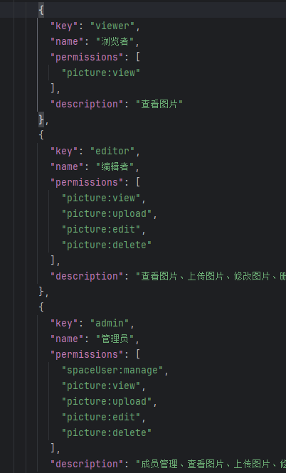
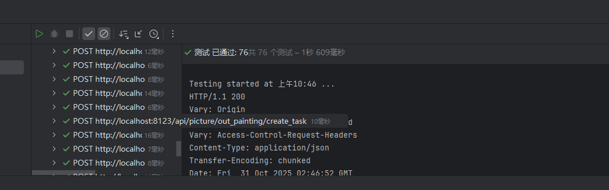

# AI 图库项目学习笔记

## 10.项目优化计划

### 1.个人中心优化

#### 1.1 需求分析

**新增个人中心**：

- 用户可查看基本信息。
- **编辑资料**：支持用户修改昵称、个人简介。
- **头像管理**：支持用户上传/更新个人头像，并实时预览。
- **好友列表**：允许用户根据用户名/用户id添加好友

## 9.图片协同编辑

### 1.项目背景与目标

这里要做的是多用户协同工作，重点是协同。就像是腾讯云文档的多人编辑一样。对于图库来说意义会小一些，我觉得可能在多人代码，或者是C段的一些检测APP，游戏地图互动标点这些会有点用。这里我主要是用图库作为载体，练习协同操作。积累经验后，希望能迁移到其他任务流程去

### 2.需求分析

**挑战一：并发冲突** 在多人实时协作场景下，多个用户可能同时发起编辑操作，若不加控制，会导致客户端状态不一致（如A旋转1次，B旋转2次，最终状态混乱）。

- **解决方案**：采用**基于业务的乐观锁机制**进行并发控制。我们约定“同一时刻只允许一位用户持有编辑权限”，后端通过一个`ConcurrentHashMap`来维护每张图片的“编辑锁”（`pictureEditingUsers`）。
  - **进入编辑 (`ENTER_EDIT`)**：用户申请编辑时，后端检查该图片的锁是否已被占用，若未占用则“加锁”，并向所有客户端广播“某某正在编辑”的通知。
  - **执行操作 (`EDIT_ACTION`)**：只有持有锁的用户发起的编辑操作才会被处理和广播。
  - **退出/断开 (`EXIT_EDIT`/`disconnect`)**：用户主动退出或意外断开连接时，后端会“释放锁”，并通知所有客户端可以开始申请编辑。

**挑战二：实时性与性能** 协同编辑要求极低的延迟。传统的HTTP轮询无法满足需求，而WebSocket虽然实现了长连接，但其同步处理消息的机制在高并发下可能成为性能瓶颈（后一个操作需等待前一个处理完毕）。

- **解决方案**：
  1. **技术选型**：选用**WebSocket**作为底层通信协议，实现服务器与客户端的全双工实时通信。
  2. **异步化改造**：引入**Disruptor高性能无锁队列**，将WebSocket的消息处理流程优化为**生产者-消费者模式**。
     - **生产者**：WebSocket处理器（`PictureEditHandler`）接收到消息后，不直接处理，而是立即将其封装成一个事件（`PictureEditEvent`）并发布到Disruptor的RingBuffer中。
     - **消费者**：专门的事件处理器（`PictureEditEventWorkHandler`）从RingBuffer中获取事件并执行真正的业务逻辑（如广播消息），从而将**网络I/O线程与业务逻辑线程解耦**，大幅提升系统的吞吐量和响应速度。

### 3.技术选型与实现思路

在实时通讯的业务场景中，常用的技术方案包括长轮询、SSE 和 WebSocket。由于我们的业务需求需要实现频繁且高效的双向通信，因此我们选用 WebSocket 来实现即时通讯。WebSocket 是一条 **“常开的隧道”**，连接的双方可以随时发送和接收数据，而不需要不断建立和关闭连接。但它们是紧密相关的，都是基于 TCP 协议、都可以在同样的端口上工作（比如 80 和 443）。一定程度上WebSocket算是HTTP的升级

|    对比项    |                HTTP                |             WebSocket              |
| :----------: | :--------------------------------: | :--------------------------------: |
|   通信模式   |        请求 - 响应（单向）         |         全双工通信（双向）         |
|   连接状态   |        每次请求创建新的连接        |         握手后保持持续连接         |
| 数据传输效率 |  每次通信都需要带完整头部，开销大  |         数据帧小，传输高效         |
|   适用场景   | 静态网页加载、API 调用等非实时场景 | 实时交互场景，如聊天、游戏、直播等 |

对于 Java Spring 项目，主要有原生 WebSocket（基于`WebSocketHandler` 实现）、STOMP、WebFlux 这 3 种实现方式。它们之间的对比如下：

| 实现方式                     | 特点                            | 优点                              | 缺点                                 | 适用场景                       |
| ---------------------------- | ------------------------------- | --------------------------------- | ------------------------------------ | ------------------------------ |
| 原生 WebSocket               | 低层 API，手动管理连接与消息    | 轻量、灵活、适用于简单点对点通信  | 需要手动管理会话和分发，不支持 STOMP | 简单的实时推送，低并发场景     |
| WebSocket + STOMP + SockJS   | 基于 STOMP，支持发布 / 订阅模式 | 支持 STOMP、消息代理、适配 SockJS | 依赖外部代理，配置较复杂             | 聊天室、多人协作，高级实时应用 |
| WebFlux + Reactive WebSocket | 基于 WebFlux 的响应式实现       | 高并发、非阻塞、适用于大流量场景  | 学习曲线高，不支持 STOMP             | 高并发场景、大数据流推送       |

#### 4、未来升级——Disruptor

虽然多个客户端的消息处理是可以并发执行的，但是接受消息和具体处理某个消息使用的是 **同一个线程**。如果处理消息的耗时比较长，并发量又比较高，可能会导致系统响应时间变长，甚至因为资源耗尽而服务崩溃。

最简单的方法就是开一个线程专门来异步处理消息。但是我们还要保证操作是按照顺序同步给其他客户端的，因此还需要引入一个队列，将任务按照顺序放到队列中，交给线程去处理。

于协同编辑场景，需要尽可能地保证低延迟，因此我们选用一种高级技术 **Disruptor** 无锁队列来减少线程上下文的切换，能够在高并发场景下保持低延迟和高吞吐量。

它主要通过以下几点实现高性能的消息传递机制：

1. 环形缓冲区：使用固定大小的数组，可以复用内存，避免了频繁的内存分配和垃圾回收。
2. 无锁设计：依赖 CAS（Compare-And-Swap）和内存屏障，而不是传统的锁，降低了线程切换的开销。
3. 缓存友好：最大化利用 CPU 的缓存局部性，提高访问速度。
4. 序列号机制：通过序列号管理生产者和消费者的访问，保证数据一致性。
5. 多消费者模式：支持多消费者共享同一环形缓冲区，并能配置不同的消费策略（如依赖关系、并行消费等）。

| 特性     | Disruptor                  | BlockingQueue           |
| -------- | -------------------------- | ----------------------- |
| 并发控制 | 无锁（CAS + 内存屏障）     | 基于锁（ReentrantLock） |
| 内存管理 | 固定长度的环形数组         | 动态数组或链表          |
| 性能     | 极高（百万级别消息 / 秒）  | 较低（数万消息 / 秒）   |
| 延迟     | 纳秒级别                   | 毫秒级别                |
| GC 压力  | 极低（数据复用）           | 较高（频繁创建新对象）  |
| 适用场景 | 高频实时消息处理、金融系统 | 一般生产者消费者模型    |

## 8.团队空间

### 1.项目背景与目标

为了将云图库项目从个人效率工具提升为支持**多人协同的企业级应用**，我独立设计并开发了“团队空间”模块。该模块的核心目标是实现复杂场景下的**权限隔离**与**协同操作**。

核心挑战是为新引入的“团队空间”模块，构建一套安全、灵活且与原有私有空间隔离的全新权限管理体系。

## 2. 需求分析

为实现B端协同，需求从“一对多”（1个用户 -> N张图片）转变为“多对多”（N个用户 <-> M个空间），并引入了新的业务维度：

1. **多对多关系：** 1个用户可以创建并加入多个团队空间；1个空间可以拥有多个成员。
2. **角色隔离：** 必须引入“角色”概念（如管理员、编辑者、浏览者），不同角色在**同一个空间**内具有**不同**的操作权限。
3. **权限控制：** 所有关键操作（如删除图片、邀请成员）必须被权限系统拦截和校验。
4. **前端动态渲染：** 前端UI（如操作按钮）必须根据用户在**当前空间**的权限动态显示或隐藏,很遗憾，这个还没有很成功，权限校验方面有点问题

## 3.技术选型与实现思路

### A. 认证体系：Sa-Token 多账户登录

**选型理由：** 项目原有的 `HttpSession` 登录态只能解决“是否登录”的认证（Authentication）问题，无法满足B端场景下“在特定空间是什么角色”的授权（Authorization）需求。

**实现思路：** 我引入了 `Sa-Token` 权限框架，利用其强大的**多账户登录体系**，为“团队空间”创建了一个完全独立的认证域（`StpKit.SPACE`）。这使得用户可以**同时保持**“网站主登录态”和“某个空间的登录态”，两个系统互不干扰，完美解决了认证隔离问题。

#### B. 权限模型：轻量级 RBAC（配置驱动）

**选型理由：** 为平衡开发效率与灵活性，我没有采用传统的RBAC五表模型（用户-角色-权限-菜单），而是实现了一套**“配置驱动”**的轻量级RBAC。

**实现思路：** 将角色与权限（`Permission`）的映射关系存储在一个 `spaceUserAuthConfig.json` 配置文件中，由后端在启动时加载。这实现了**配置与代码的分离**，当需要调整角色能力（比如给“编辑者”增加新权限）时，只需修改JSON配置即可，无需改动和重新部署Java业务代码。

本项目权限系统的设计思想源于经典的 **RBAC (Role-Based Access Control)** 模型，其核心是**用户-角色-权限**的分离。

- **设计决策**：为快速迭代并降低初期复杂度，我没有采用传统的五表关联模型，而是实现了一套**基于硬编码规则**的轻量级权限系统。所有权限规则由后端统一管理，前端仅负责根据权限列表动态渲染UI，实现了前后端职责分离。
- **技术实现**：
  - **认证框架**：深度整合了 `Sa-Token` 权限认证框架，利用其多账户登录体系，为“用户空间”和“团队空间”创建了隔离的认证域。
  - **权限校验**：通过自定义注解 `@SaSpaceCheckPermission` 结合 **Spring AOP**，对所有团队空间的关键操作（如增删改查）实现了声明式的、非侵入式的权限校验。
  - **配置驱动**：将角色与权限的映射关系维护在一个 **JSON 配置文件**中，当需要调整角色能力时，只需修改配置即可，无需改动业务代码，提高了系统的可维护性。

| **角色** |                        **对应权限键**                        |                  **可执行功能**                  |
| :------: | :----------------------------------------------------------: | :----------------------------------------------: |
|  浏览者  |                        `picture:view`                        |                     查看图片                     |
|  编辑者  | `picture:view`, `picture:upload`, `picture:edit`, `picture:delete` |      查看图片、上传图片、修改图片、删除图片      |
|  管理员  | `spaceUser:manage`, `picture:view`, `picture:upload`, `picture:edit`, `picture:delete` | 成员管理、查看图片、上传图片、修改图片、删除图片 |

在具体的实现上，我们有两种方案：

1）最直接的方案是像之前校验私有空间权限一样，封装个团队空间的权限校验方法；或者类似用户权限校验一样，写个注解 + AOP 切面。

2）对于复杂的角色和权限管理，可以选用现成的第三方权限校验框架来实现，编写一套权限校验规则代码后，就能整体管理系统的权限校验逻辑了。

然后 是空间数据管理内容，因为在图片数量达到一定程度时，会导致内容太多查询效率变低。

数据的管理上我们有两个方案：1、图片信息数据，给每个团队空间单独创建一张图片表。2.**图片文件数据**已经将每个空间的图片存到不同的路径中了，实现了隔离，无需额外开发。

到目前为止，我们开发的东西都是围绕着spaceuser生成，包括一个实体，一个包装，一个接受类。服务上主要是复用之前的增加删除代码。问题在于SpaceRoleEnum的枚举，之所以有这个是因为我要把用户的角色分成三类，和之前的SpaceTypeEnum不一样，SpaceTypeEnum是分离空间的。

那么接下来就是hi做spaceuser的服务了，这个服务应该包括增删改查，CURD

不过，团队空间本质上就是空间权限是团队的私有空间，这就代表我们的代码一定程度上是可以复用的。这里做得最多的就是各种复制粘贴

重头戏还是在权限控制，根据学习，我们之前提出的权限控制是写死用户身份和权限的对应，这是为了节约空间的操作嘛。这里采用的写法是一个JSON格式的文件，里面是【允许的操作，用户角色】这样的表。



记录过程中学习到的知识

| **过程**                  | **通用概念**                   | **JSON 格式下的具体操作 (以 Hutool 为例)** |
| ------------------------- | ------------------------------ | ------------------------------------------ |
| **Object -> Byte Stream** | **序列化 (Serialization)**     | `JSONUtil.toJsonStr(userObject)`           |
| **Byte Stream -> Object** | **反序列化 (Deserialization)** | `JSONUtil.toBean(jsonString, User.class)`  |

使用satoken来做java权限认证

按理来说不只是VIS这个封装类，分页 的应该也要把这个权限补上,但是教程里没有做这部分工作

我注意到教程只在详情页返回了权限列表，但这会导致列表页的按钮无法根据权限隐藏。因此，我主动重构了分页接口，使其在批量查询时也能高效地（通过Map和批量查询，而不是N+1）为列表中的每一项都注入权限，保证了前端体验的一致性。

试了下测试流程，这个有一点繁琐，但能很直观的看到程序的运行效果



动态分表的逻辑还算能理解，但是代码上有点问题。暂且搁置。

# 7.AI图片编辑功能

## 1.项目目标

本项目旨在为现有的智能云图库系统**追加**两项核心功能：

1. **基础图片编辑**：实现用户对已上传图片的在线裁剪、旋转等基础操作。
2. **AI 智能扩图**：集成阿里云大模型服务，为用户提供高级的 AI 图像生成与扩展能力。

## 2. 需求分析

核心需求是为用户构建一个**一站式的图片处理工作流**。用户在平台上传图片后，无需切换到 Photoshop 等外部专业工具，即可**在系统内部闭环完成**从基础调整到 AI 创意生成的全部操作，旨在显著提升用户体验和平台功能完整性。

## 3. 技术选型与实现思路

### 3.1. 基础图片编辑 (前端实现)

- **设计思想**：为了最小化对现有代码的侵入，我采用了“**增量优化**”的思路。将图片编辑功能封装为一个**独立的 Vue 组件 (`ImageCropper.vue`)**，而不是重构原有的上传流程。
- **实现方式**：在图片上传/详情页上新增“编辑图片”按钮。用户点击时，前端获取当前图片的 `pictureId` 和 `url`，并将其作为 `props` 传递给 `ImageCropper` 组件。该组件基于 `vue-cropper` 库实现，用户完成裁剪后，前端将新生成的图片**重新调用上传接口**，实现对原图的“二次编辑”和覆盖。

### 3.2. AI 智能扩图 

- **后端设计**：作为后端，我的职责是充当“**适配器**”和“**安全网关**”。我新建了一个 `Controller` 接口，专门用于**封装对“阿里云百炼”大模型 API 的调用**。这样做的好处是：
  1. **安全**：API 密钥 (API Key) 等敏感信息由后端统一管理，不会暴露给前端。
  2. **校验**：在调用昂贵的 AI 服务前，后端可以对 `pictureId`、用户权限等进行严格的**前置校验**。
  3. **解耦**：前端不需要关心底层用的是哪家 AI 服务，未来可以无缝切换。
- **核心挑战 (异步处理)**：AI 图像生成是一个**长耗时任务**（可能需要 10-30 秒）。如果采用常规的“**同步阻塞**”方案（即后端 `Controller` 接到请求后，一直等待阿里 API 返回结果），会导致服务器的 **Tomcat 线程被长时间占用**，无法接收新的请求，造成服务“假死”。
- **最终方案 (异步轮询)**：我摒弃了“后端阻塞”方案，转而设计了**“异步轮询”**机制，这也是企业级处理长耗时任务的最佳实践：
  1. **后端 (创建任务)**：后端在收到前端请求后，立即调用阿里云 API **创建任务**，并**秒级返回 `task_id`** 给前端，该 HTTP 连接立即释放。
  2. **前端 (发起轮询)**：前端在拿到 `task_id` 后，启动一个**定时器 (`setInterval`)**，开始**异步轮询**后端的“任务查询”接口。
  3. **后端 (查询任务)**：提供一个轻量级的查询接口，根据 `task_id` 去阿里云查询任务状态 (`SUCCEEDED` / `FAILED`)，并将状态实时返回给前端。
  4. **前端 (展示结果)**：一旦轮询到 `SUCCEEDED` 状态，立即清除定时器，并从响应中获取 `output_image_url` 在页面上进行展示。

## 4. 遇到的问题与解决方案

1. **问题：`git push` 失败，提示“密钥泄露” (GH013)。**
   - **原因**：在本地 `application-local.yml` 中配置了云服务密钥，并错误地将其 `commit` 到了 Git。
   - **解决**：使用了 `git reset --soft HEAD~1` 和 `git commit --amend` 来修改本地的上一次提交，从 Git 历史中移除了密钥。并深刻理解了 `.gitignore` 不会忽略已被追踪文件的机制。
2. **问题：前端组件不显示或报错 `Failed to resolve component`。**
   - **原因**：在父组件中使用了 `<ImageCropper>` 标签，但在 `<script setup>` 中忘记了 `import` 对应的组件文件。
   - **解决**：在父组件中补充 `import` 语句，建立了正确的组件依赖关系。
3. **问题：父组件无法调用子组件的 `openModal()` 方法 (报错 `is not a function`)。**
   - **原因**：Vue 3 的 `<script setup>` 默认组件实例是封闭的，父组件无法直接访问子组件内部的方法。
   - **解决**：在子组件 (`ImageCropper.vue`) 中，通过 `defineExpose` 宏主动暴露 `openModal` 方法，使其可以被父组件的 `ref` 引用正确调用。
4. **问题：图片上传成功后，下方的“图片信息”表单不显示。**
   - **原因**：排查后发现是**跨域 (CORS)** 配置问题。虽然首次上传 HTTP 状态码为 200，但浏览器因 CORS 策略拦截了响应体（Response Body），导致前端 `onSuccess` 回调拿到的 `newPicture` 是空对象，进而导致 `pictureForm.tags` 为 `undefined`。最终 `<a-select mode="tags">` 组件因期待数组却拿到 `undefined` 而渲染崩溃。
   - **解决**：**1. (后端)** 修正了后端的 CORS 策略，确保响应体能被前端正确读取。**2. (前端)** 将 `pictureForm.tags` 字段初始化为空数组 `[]`，增强了代码的健壮性。

# 6.图库优化

上传的图片存在缓存问题，在现在的小体量没关系，但是大体量的情况下要能解决。学习了两种方案，REDIS分布式缓存和caffeine本地缓存。这两个缓存使用后，首次查询从55ms变成了500ms，后续查询从14ms变成了8ms左右。在后续优化上，还是有明显效果的。

然后是针对图片大小的优化，考虑到公共图库相片过多，我需要一些方法帮助我显示缩略图，这里我使用的是COS自带的方法，对于上传的文件，我将其进行压缩，处理到128*128，然后让前端文件优先读取压缩图片的路径。等到下载的时候，再使用正常大小的图片。也就是常见的【显示原图】那种功能的另类实现吧，这也是之后的一个优化方向。

此外，还针对session登陆状态不持续的情况做了优化，这一部分在applcation里面配置完成，难度较低，仅做记录仪。

但是问题也是存在的：

我是用REDIS分布式缓存，设置了五分钟作为刷新间隔，问题在于，我只有在查询的时候进行了设置。这代表当我上传一张图片后，往往需要五分钟才能完成缓存和数据库的同步。要进一步修改的话，我觉得就需要在上传，删除，更新的时候都加上对于缓存的刷新机制。

# 5.用户私有空间模块

问题开始出现了，心累。记录一下，以后修改：

1.管理员添加的图片同时在它的私有空间和公共空间

增加默认查询参数nullSpaceId: true,解决问题

2.用户添加的图片无法在自己的私有空间中看到

找到问题所在了，首先F12检查查询是否正常，发现没有报错，那就说明查询这个过程是没问题的。问题是为什么没有显示。在做这个功能前，我是和用户模块一起做的，管理员那边可以看到自己的私有空间。这就说明问题可能在图片管理模块，而且很有可能是我错误设置了权限，导致一些图片明明是私有的，却要求管理员权限才能看到，就像是公共空间里面屏蔽私有空间图片那样。

但检查完后端，发现那也不是问题，检查前端，发现是前端发送查询请求时，给到了错误的后端接口导致的。修改后解决

## 4. 核心功能 - 用户模块

在完成项目初始化和前后端联动配置后，我们开始开发第一个核心功能模块——用户模块。该模块是系统的基础，涵盖了用户的整个生命周期，包括注册、登录、信息管理和权限控制。

### 4.1. 用户模块 (后端)

**目标:** 实现用户注册、登录、权限控制和后台管理等一套完整的服务端功能。

#### 功能实现 breakdown

1. **库表设计**:
   - 设计了 `user` 表，包含 `userAccount` (唯一)、`userPassword`、`userName`、`userRole` (默认为 `user`) 等核心字段。
   - 使用了逻辑删除字段 `isDelete`，并通过 `@TableLogic` 注解实现了无感知的逻辑删除功能。
2. **用户注册与登录**:
   - **注册**: 实现了注册接口，包含对账号、密码长度、两次密码一致性等参数的后端校验。
   - **密码加密**: 为了数据安全，密码在存入数据库前，通过 `DigestUtils.md5DigestAsHex` 结合固定盐值 (`SALT`) 进行了 MD5 加密。
   - **登录**: 实现了登录接口，通过查询加密后的密码来验证用户身份。登录成功后，将脱敏后的用户信息存入 `Session`，作为后续请求的用户凭证。
3. **信息脱敏与封装**:
   - 遵循“最小暴露”原则，创建了 `LoginUserVis` 和 `UserVis` 类。
   - 在返回给前端数据时，通过 `BeanUtils.copyProperties` 将 `User` 实体对象转换为 Vis 对象，去除了 `userPassword` 等敏感字段，保证了接口的安全性。
4. **权限控制 (AOP)**:
   - 这是后端的一个设计亮点。通过 **Spring AOP** 和 **自定义注解** 实现了声明式的权限控制。
   - **`@AuthCheck` 注解**: 一个自定义注解，可以标记在任何 Controller 方法上，通过 `mustRole` 参数指定访问该接口所必需的角色（如 `admin`）。
   - **`AuthInterceptor` 切面**: 使用 `@Aspect` 定义了一个切面，通过 `@Around` 环绕通知拦截所有标记了 `@AuthCheck` 的方法。在方法执行前，切面会获取当前登录用户并校验其角色，如果权限不足则直接抛出异常，实现了与业务逻辑的完全解耦。
5. **用户管理 (CRUD)**:
   - 为管理员提供了完整的用户增、删、改、查功能。
   - **查询**: 实现了分页、模糊查询和排序功能。通过 `getQueryWrapper` 方法动态构建 MyBatis-Plus 的查询条件，代码逻辑清晰且扩展性强。
   - **接口保护**: 所有管理接口均通过 `@AuthCheck(mustRole = UserConstant.ADMIN_ROLE)` 注解进行了保护，确保只有管理员才能调用。
6. **通用问题修复**:
   - **分页插件配置**: 通过添加 `MyBatisPlusConfig` 配置类并注册 `PaginationInnerInterceptor`，解决了 MyBatis-Plus 分页插件不生效的问题。
   - **JSON精度修复**: 由于 JavaScript 的 `Number` 类型无法精确表示 Java 的 `Long` 类型最大值，通过 Spring MVC 的 `JsonConfig` 将所有返回的 `Long` 类型序列化为 `String`，解决了前端ID精度丢失的问题。


### 4.2. 用户模块 (前端)

**目标:** 构建用户登录、注册、管理等页面，并实现全局的用户状态管理和前端路由权限控制。

#### 核心实现分析

1. **页面与路由**:
   - 在 `pages` 目录下创建了 `UserLoginPage.vue`、`UserRegisterPage.vue` 和 `UserManagePage.vue` 三个核心页面。
   - 在 `router/index.ts` 中配置了这些页面的路由规则，将 URL 路径与对应的 Vue 组件关联起来。
2. **全局状态管理 (Pinia)**:
   - 这是前端状态管理的核心。`stores/useLoginUserStore.ts` 负责维护全局的用户登录信息。
   - **`fetchLoginUser`**: 应用初始化或用户登录成功后，会调用此方法，通过 `getLoginUserUsingGet` 接口从后端获取当前用户信息，并将其保存在 `store` 中。
   - **响应式UI**: `GlobalHeader.vue` 等组件会监听 `store` 中的 `loginUser` 状态。当用户登录或注销时，`store` 状态改变，页面右上角会自动切换显示“用户名”或“登录按钮”，实现了UI的响应式更新。
3. **用户操作界面 (Ant Design Vue)**:
   - **登录/注册**: 使用 `<a-form>` 组件构建了标准的登录和注册表单，包含输入校验规则。表单提交时，调用 `openapi` 生成的 `userLoginUsingPost` 等请求函数与后端交互，并使用 `<a-message>` 组件向用户反馈操作结果（如“登录成功”）。
   - **用户管理**: `UserManagePage.vue` 页面使用 `<a-table>` 组件展示用户列表。
     - **数据获取**: 在组件挂载时 (`onMounted`) 和分页/搜索条件变化时，调用 `fetchData` 方法，通过 `listUserVoByPageUsingPost` 接口获取数据并更新表格。
     - **交互功能**: 实现了搜索表单和表格分页功能，通过监听 `@change` 事件和点击搜索按钮来更新查询参数并重新请求数据。
4. **前端权限控制 (路由守卫)**:
   - 在 `src/access.ts` 文件中，利用 `vue-router` 的 **全局前置守卫 (`router.beforeEach`)** 实现了前端的权限控制。
   - **工作流程**: 在每次路由跳转前，守卫会触发。它会检查目标路径是否为 `/admin` 开头。如果是，则会从 `useLoginUserStore` 中获取当前用户的角色，判断是否为 `admin`。
   - **拦截与重定向**: 如果用户不是管理员却试图访问管理员页面，守卫会中断当前的导航，并通过 `message.error` 给出提示，然后将用户重定向到登录页。这有效地保护了前端的敏感页面。

------------------------------------------------------------------------------------------------------------------------------------------------------------------------------------------------------------------------------------------

## 1.项目初始化 (后端)

**目标:** 搭建整个 Spring Boot 项目的基础架构，为后续所有功能模块提供通用的响应、异常处理和基础配置。

### 项目UML类图


### 核心组件分析

#### 1. 统一响应体 (`commen` 包)

-   **`BaseResponse<T>`**: 定义了所有后端接口返回给前端的数据结构。包含 `code` (状态码), `data` (泛型数据), `message` (信息) 三个字段，是后端 API 设计规范化的基础。
-   **`ResultUtils`**: 封装了创建 `BaseResponse` 对象的静态方法（如 `success` 和 `error`），简化了代码，避免在业务代码中频繁 `new BaseResponse`。

#### 2. 统一异常处理 (`exception` 包)

-   **`ErrorCode` (枚举)**: 统一定义了项目中所有业务相关的错误码和错误信息，便于管理和维护。
-   **`BusinessException`**: 自定义业务异常类。在业务逻辑中，当遇到可预见的错误（如“用户名不存在”）时，应抛出此异常。
-   **`GlobalExceptionHandler`**: 全局异常处理器。通过 `@RestControllerAdvice` 注解，可以捕获项目中抛出的所有异常（如 `BusinessException`, `RuntimeException` 等），并将其转换为统一格式的 `BaseResponse` 返回给前端，避免了将堆栈信息直接暴露给用户。
-   **`ThrowUtils`**: 异常抛出工具类。通过 `throwIf` 方法，可以用一行代码实现“如果条件成立，则抛出异常”，让业务代码更简洁。

#### 3. 通用配置 (`config` 包)

-   **`CorsConfig`**: 全局跨域配置。解决了前端应用在不同域名下调用后端 API 时产生的跨域问题。

#### 4. 应用入口及健康检查

-   **`CloudApplication`**: Spring Boot 主启动类。
-   **`MainController`**: 提供了一个 `/health` 健康检查接口，用于确认后端服务是否正常运行。

---

## 2.项目初始化 (前端)

**目标:** 使用 Vue3 和 Ant Design Vue 搭建项目的基础布局和导航，为后续页面提供统一的视觉框架。

### 核心组件分析

#### 1. 应用入口 (`App.vue`)

-   [cite_start]**`App.vue`**: 作为 Vue 应用的根组件 [cite: 1][cite_start]，它的核心作用是加载全局布局组件 `BasicLayout` [cite: 1]。它是整个前端页面的起点。

#### 2. 全局布局 (`BasicLayout.vue`)

-   **`BasicLayout.vue`**: 定义了应用的整体页面结构，包括顶部导航栏、中间内容区和底部信息栏。
    -   **`<a-layout-header>`**: 承载全局导航栏 `GlobalHeader`。
    -   **`<a-layout-content>`**: 内部使用 `<router-view />`，这是 Vue Router 的核心，用于根据当前 URL 动态渲染不同的页面组件。
    -   **`<a-layout-footer>`**: 固定的底部栏，包含项目链接等信息。

#### 3. 全局顶栏 (`GlobalHeader.vue`)

-   **`GlobalHeader.vue`**: 实现了网站的顶部导航功能，主要分为三个部分：
    -   **左侧Logo区**: 展示项目 Logo 和名称“海东文库”，点击可返回主页。
    -   **中间菜单区**: 使用 Ant Design 的 `<a-menu>` 组件，动态生成导航菜单，并通过 `vue-router` 实现页面跳转。
    -   **右侧登录区**: 放置一个“登录”按钮，引导用户进行登录操作。

### 学习要点

-   **组件化开发**: 前端界面被拆分为 `App` -> `BasicLayout` -> `GlobalHeader` 等多个层级分明、职责清晰的组件。
-   **路由驱动视图**: 通过 `vue-router` 管理 URL 和视图的对应关系，使用 `<router-view />` 作为页面容器。
-   **UI框架集成**: 借助 Ant Design Vue 快速构建美观且统一的页面布局和组件。

---

## 3. 前后端高效联动 - API自动化

**目标:** 实现后端API变更后，前端能够自动生成对应的请求代码，从而提高开发效率、降低沟通成本并确保类型安全。

### 工作流总览

整个流程分为两步：
1.  **后端自动生成API文档**: 后端项目通过集成 **Knife4j** 等插件，自动扫描所有 Controller 接口，并生成一个遵循 [OpenAPI Specification](https://swagger.io/specification/) (OAS) 标准的 JSON 文件。
2.  **前端基于API文档生成代码**: 前端项目执行一个脚本，通过 **`@umijs/openapi`** 工具读取后端生成的 JSON 文件，并自动生成所有接口的请求函数和 TypeScript 类型定义。

### 3.1. 后端实现：API文档生成

后端通过在 Maven/Gradle 中引入 `knife4j-openapi2-spring-boot-starter` (或其他类似) 依赖，实现了API文档的自动化。

-   **工作原理**:
    -   项目启动后，Knife4j 会自动扫描所有被 `@RestController` 注解标记的类。
    -   它会解析类中的 `@GetMapping`, `@PostMapping` 等注解，以及方法的参数和返回值。
    -   根据这些信息，它在内存中构建了一个描述所有API接口的结构化数据。
-   **最终产物**:
    -   一个可视化的API文档页面，我这里设置访问地址为 `http://localhost:8123/api/doc.html`，方便后端人员自测和前端人员查阅。
    -   一个原始的 OpenAPI 规范JSON文件，访问地址为 `http://localhost:8123/api/v2/api-docs`。**这个地址是前后端联动的关键**。

### 3.2. 前端实现：API代码生成

前端通过 `openapi.config.js` 配置文件和 `@umijs/openapi` 库来消费后端产出的API文档。

-   **核心配置 (`openapi.config.js`)**:

    ```javascript
    import { generateService } from '@umijs/openapi'

    generateService({
      requestLibPath: "import request from '@/request'",
      // 指向后端生成的 OpenAPI JSON 文件的地址
      schemaPath: 'http://localhost:8123/api/v2/api-docs',
      // 生成的前端代码存放目录
      serversPath: './src',
    })
    ```

-   **执行脚本**: 在 `package.json` 中配置了如下命令：

    ```json
    "scripts": {
      "openapi": "node openapi.config.js"
    }
    ```

-   **工作流程**:
    1.  在本地同时启动前端和后端服务。
    2.  在前端项目根目录下，执行 `npm run openapi` 命令。
    3.  `@umijs/openapi` 工具会请求 `schemaPath` 指定的URL，获取到API的JSON描述文件。
    4.  工具会解析这个JSON文件，并自动在 `./src/services` 或类似目录下生成所有接口的TypeScript请求函数，包括完整的参数和返回值类型定义。

### 总结

这种开发模式极大地提升了协同效率。每当后端修改、增加或删除了接口，只需要：
1.  后端重启服务，`api-docs` 就会自动更新。
2.  前端执行一次 `npm run openapi`。

这样，前端就能获得与后端完全同步的、带有类型提示的API请求代码，无需手动编写和调试接口。
