# AI 图库项目学习笔记

## 10.遗留问题解决

1.前后端结合起来时，发现前端左侧，我的空间下方存在脏空间，不是该用户所属的空间被错误显示出来：

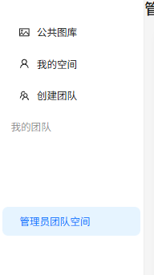

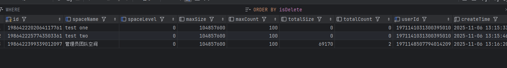

只有管理员团队空间才是所属的空间

2.普通用户可以创建空间，但居然没有任何权限：

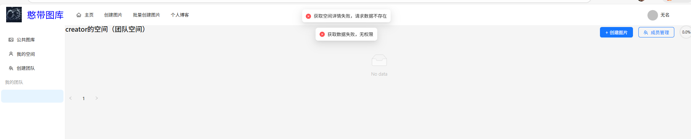

不过，可以看到它能够正常进入团队管理界面

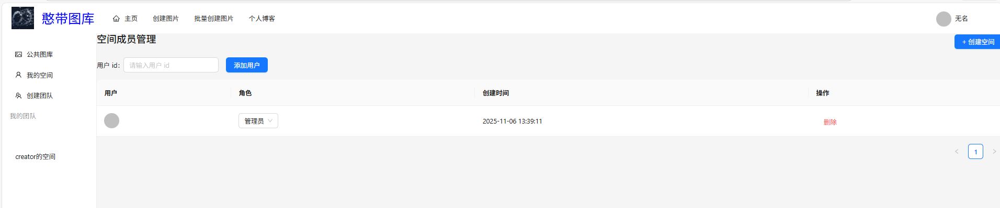

且可以正常添加用户并修改其权限：

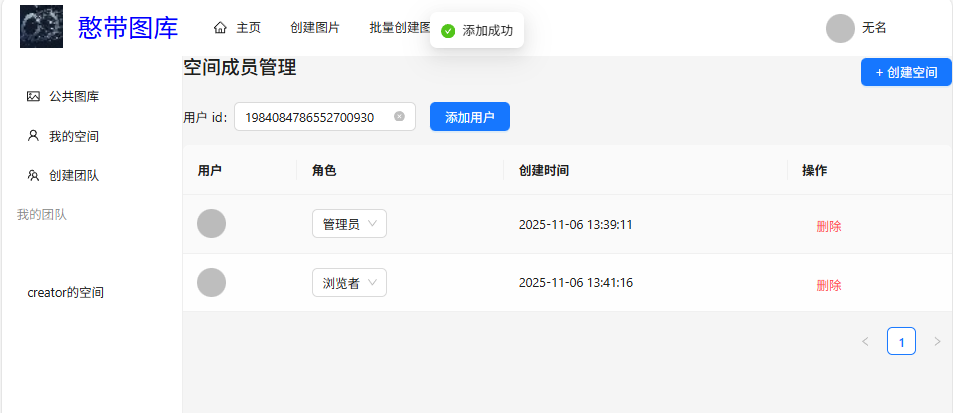

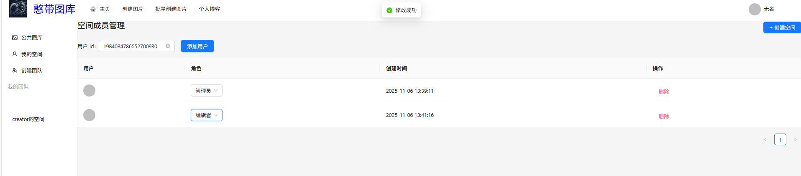

这说明问题不在于空间的创建。主要是两块：1是权限校验出了问题。2是左侧的显示没有正常起到过滤效果。

从对空间成员的增删改查可以正常工作来看，SpaceUserController是没有问题，问题出在SpaceController上。正好里面有 @AuthCheck(mustRole = UserConstant.ADMIN_ROLE)。先尝试注释全部权限代码，看是否可以正常工作-》发现依然报错，获取数据异常。

无法简单排查，现在转向查看后端日志，根据我的测试报告结果，这次的问题应该主要是在后端的com.et.cloud.controller.aop.AuthInterceptor.java和 `com.et.cloud.controller.PictureController.java`是最需要检查的文件。

定位到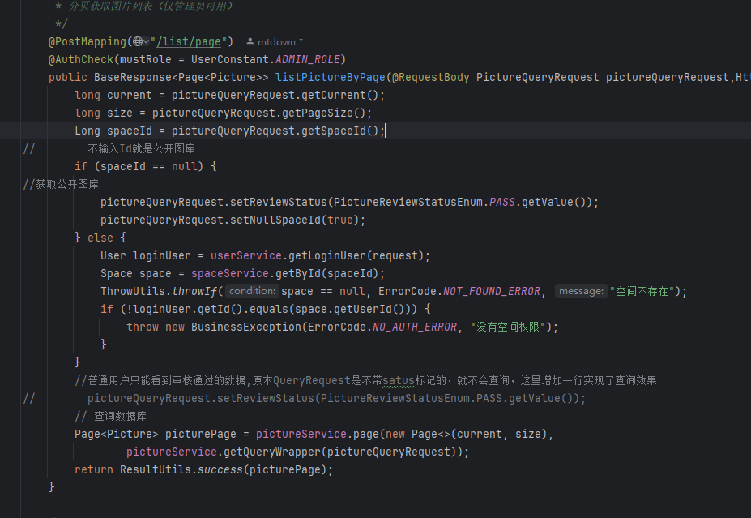

显然，这个文件是给管理员调用图片的，而我当前用户的身份User,当然会报错。那么这个问题实际上出现在前端！前端错误的将User对象获取图片的信息调用了管理员的图库，注释掉权限后发现成功添加，并且可以查找到图片了！方向是正确的。接下来只需要修改前端界面调用正确的VIS设置即可

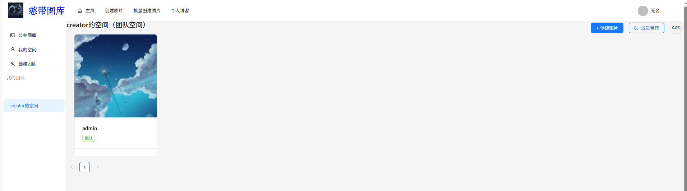

------

## 当前bug：

1.用户权限问题

虽然可以加入新的用户，但是用户不能查看图片，哪怕换成管理员权限也是一样，本质是幽灵组员.

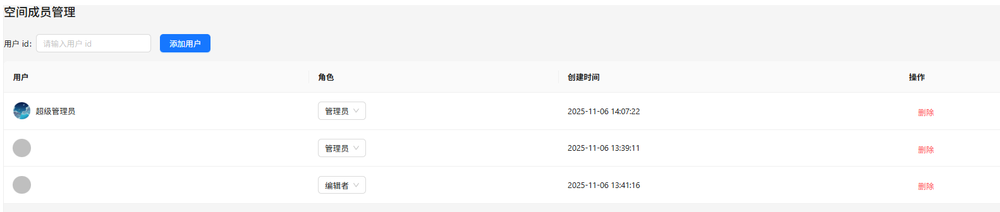

即使是可以看到“超级管理员”也不能在“管理员”角色下进入Creater空间

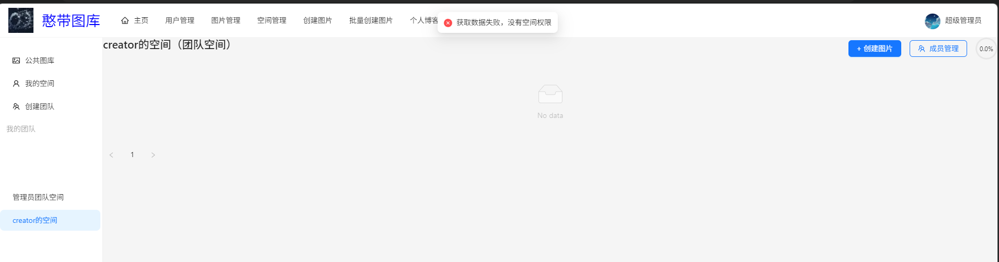

2.左侧侧边栏视野问题，如上所示，管理员的侧边栏显示了不存在的空间。

## 排查错误：

1.会不会是权限认证出错呢？

不太可能，在测试文件中，我为了确认Sa-Token 登录双重认证是否正确有专门去cokkie里面获取Sa-Token 

2.从前端控制台和后端报错获取信息

```
==>  Preparing: SELECT id,spaceId,userId,spaceRole... FROM space_user WHERE (spaceId = ? AND userId = ?)
==> Parameters: 1986428149624897538(Long), 1971148507794014209(Long)
<==       Total: 1
```

这说明确实是空间成员，且有这条记录。然后是报错文件：

```
com.et.cloud.exception.BusinessException: 没有空间权限
    at com.et.cloud.controller.PictureController.listPictureByPage(PictureController.java:224)
```

查询到代码：

```
    @PostMapping("/list/page")
//    @AuthCheck(mustRole = UserConstant.ADMIN_ROLE)
    public BaseResponse<Page<Picture>> listPictureByPage(@RequestBody PictureQueryRequest pictureQueryRequest,HttpServletRequest request) {

        long current = pictureQueryRequest.getCurrent();
        long size = pictureQueryRequest.getPageSize();
        Long spaceId = pictureQueryRequest.getSpaceId();
//        不输入Id就是公开图库
        if (spaceId == null) {
//获取公开图库
            pictureQueryRequest.setReviewStatus(PictureReviewStatusEnum.PASS.getValue());
            pictureQueryRequest.setNullSpaceId(true);
        } else {
            User loginUser = userService.getLoginUser(request);
            Space space = spaceService.getById(spaceId);
            ThrowUtils.throwIf(space == null, ErrorCode.NOT_FOUND_ERROR, "空间不存在");
            if (!loginUser.getId().equals(space.getUserId())) {
                throw new BusinessException(ErrorCode.NO_AUTH_ERROR, "没有空间权限");
            }
        }
        //普通用户只能看到审核通过的数据,原本QueryRequest是不带satus标记的，就不会查询，这里增加一行实现了查询效果
//        pictureQueryRequest.setReviewStatus(PictureReviewStatusEnum.PASS.getValue());
        // 查询数据库
        Page<Picture> picturePage = pictureService.page(new Page<>(current, size),
                pictureService.getQueryWrapper(pictureQueryRequest));
        return ResultUtils.success(picturePage);
    }
```

发现结果：

```
if (!loginUser.getId().equals(space.getUserId())) {
    throw new BusinessException(ErrorCode.NO_AUTH_ERROR, "没有空间权限");
}
```

这一条代码的逻辑是判断当前用户的ID是不是当前空间创造者的ID。但是这里我们是团队空间啊，应该使用团队空间的校验逻辑——也就是我们satoken。

在删除掉多余代码，并补回：@AuthCheck(mustRole = UserConstant.ADMIN_ROLE)后，这样才是正常的。

```
//        不输入Id就是公开图库
        if (spaceId == null) {
//获取公开图库
            pictureQueryRequest.setReviewStatus(PictureReviewStatusEnum.PASS.getValue());
            pictureQueryRequest.setNullSpaceId(true);
        } else {
            User loginUser = userService.getLoginUser(request);
            Space space = spaceService.getById(spaceId);
            ThrowUtils.throwIf(space == null, ErrorCode.NOT_FOUND_ERROR, "空间不存在");
            if (!loginUser.getId().equals(space.getUserId())) {
                throw new BusinessException(ErrorCode.NO_AUTH_ERROR, "没有空间权限");
            }
        }
```

然后我就发现Creator不能正常访问自己的空间了。答案很明显了，错误和上一个是一样的。前端检查空间的代码用错了。

修改前端的SpaceDetailPage.vue，解决。

```
// 错误
const res = await listPictureByPageUsingPost(params)

// 正确
const res = await listPictureVisByPageUsingPost(params)
```

不过新问题也出来了，我们看不到图片了。从数据库来看，返回信息来看都是正确上传了的。在考虑我们修改后的代码。显然是审核状态不通过的问题。

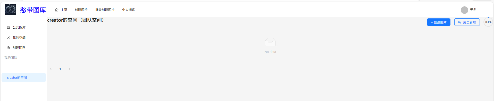

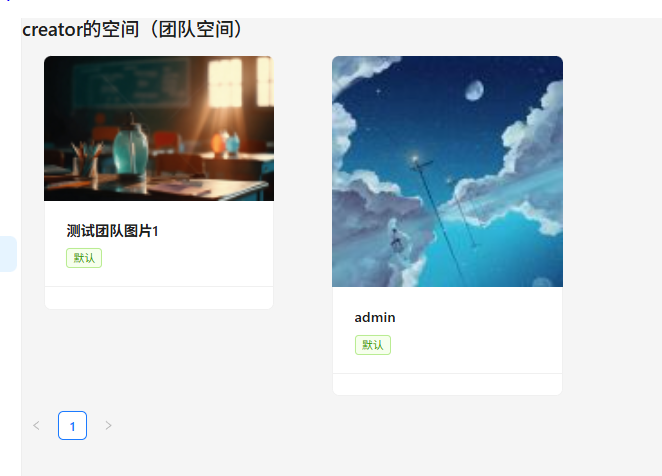


果然，刷新后可见了。

------

接下来我们来处理另一个问题：用户会获取到不属于自己的空间图表并展示到globalsider

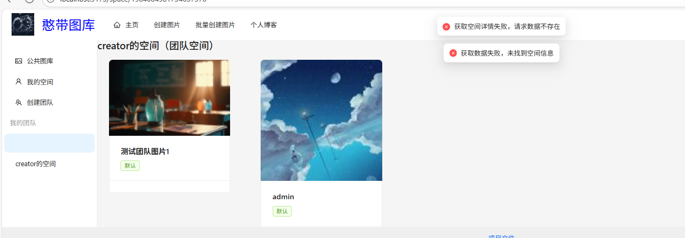

此外，还有一个有趣的情况，系统管理员能看到的账号空间数量是比普通用户要多的：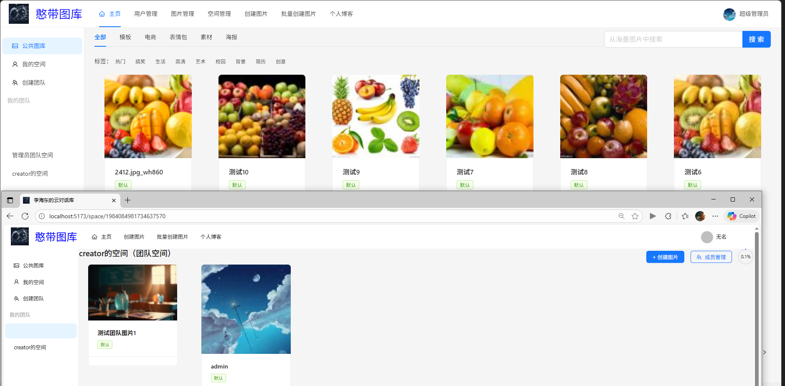

经过创建多个空间和检查空间返回代码后，我们可以确定：应该是像后端发送了一个脏空间ID。构建查询代码后返回：

```
[2025-11-08 15:32:39] 正在连接到 @localhost… (Cloud)
[2025-11-08 15:32:39] 使用批处理模式，最多 1000 条 INSERT/UPDATE/DELETE 语句
[2025-11-08 15:32:39] 运行 C:\Users\origin\IdeaProjects\Agent\cloud\sql\check.sql
SELECT * FROM space_user WHERE userId = 1984084768911458306
[2025-11-08 15:32:39] 在 5毫秒 内完成
[2025-11-08 15:32:39] 摘要: 在 13毫秒中1/1 条语句已执行 (文件中有 59 个符号)
```

显然了，一定是查询的时候使用了一个固定id，这就需要到SpaceUserServiceImpl.java文件的 `getQueryWrapper` 方法中去寻找

```
    @Override
    public QueryWrapper<SpaceUser> getQueryWrapper(SpaceUserQueryRequest spaceUserQueryRequest) {
        QueryWrapper<SpaceUser> queryWrapper = new QueryWrapper<>();
        if (spaceUserQueryRequest == null) {
            return queryWrapper;
        }
        // 从对象中取值
        Long id = spaceUserQueryRequest.getId();
        Long spaceId = spaceUserQueryRequest.getSpaceId();
        Long userId = spaceUserQueryRequest.getUserId();
        String spaceRole = spaceUserQueryRequest.getSpaceRole();
        queryWrapper.eq(ObjUtil.isNotEmpty(id), "id", id);
        queryWrapper.eq(ObjUtil.isNotEmpty(spaceId), "spaceId", spaceId);
        queryWrapper.eq(ObjUtil.isNotEmpty(userId), "userId", userId);
        queryWrapper.eq(ObjUtil.isNotEmpty(spaceRole), "spaceRole", spaceRole);
        return queryWrapper;
    }
}
```

遗憾的是，这段代码看不出问题。后端没有毛病，那就只能去看看前端的信息了，显示显示查询 `id=1984084981734637570`。

我试了下彻底清空空间表，成功了。现在侧边栏正常显示一切信息了。

------

接下来的问题是多人协同编辑上面的错误，无论有没有人加入编辑，都无法对图片进行确认：

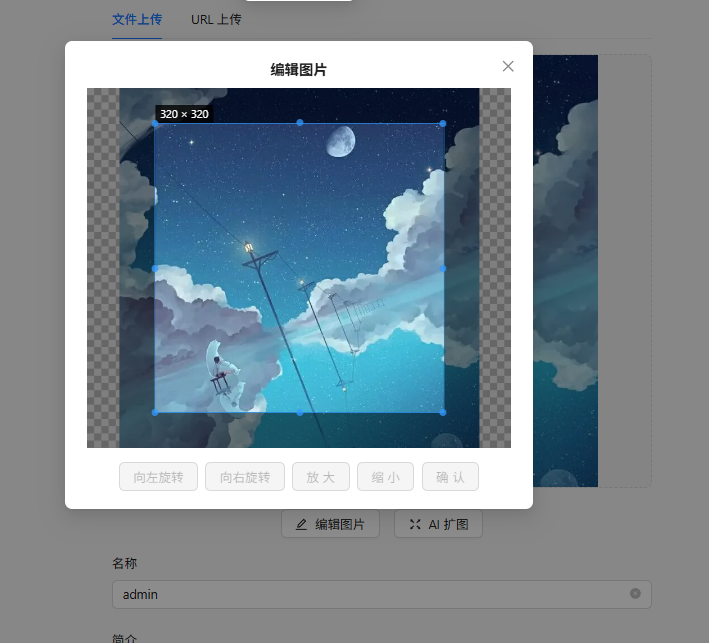

发现是前端文件漏写逻辑了：

```
const canEdit = computed(() => {
  return editingUser.value?.id === loginUser.id
})
```

修改成这个

```
const canEdit = computed(() => {
  // 如果不是团队空间，默认允许编辑
  if (!isTeamSpace.value) {
    return true
  }
  // 如果是团队空间，必须是当前用户在编辑状态
  return editingUser.value?.id === loginUser.id
})
```

问题解决
